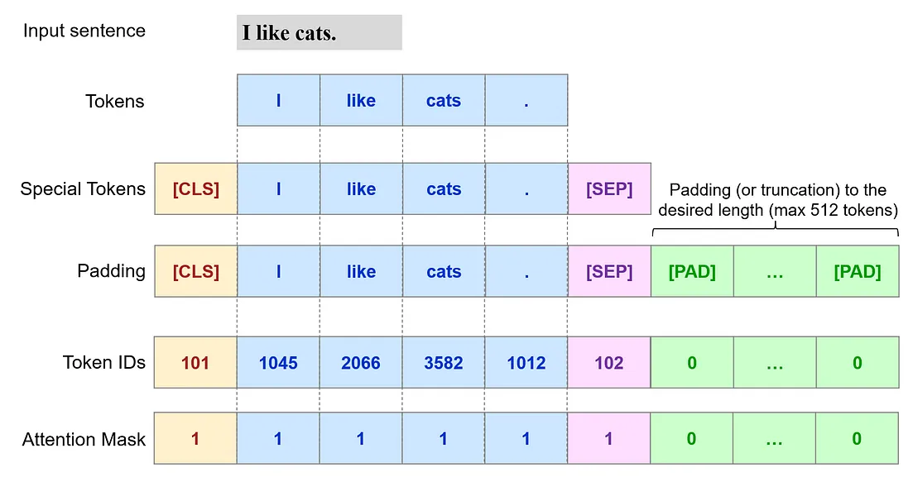

# Transformers-NLP

Notebooks for Natural Language Processing tasks with Transformers
 
Developed in Pytorch

### 1. Text generation with GPT2:
* Jupyter [Notebook](https://github.com/erikycd/Transformers-NLP/blob/main/Finetune_GPT2_eng_textgen.ipynb)
* Pretrained English GPT2
* Fine-tunning on Kaggle conversation dataset
 
### 2. Text binary classification with BERT:
* Jupyter [Notebook](https://github.com/erikycd/Transformers-NLP/blob/main/Finetune_BERT_eng_classif.ipynb)
* Pretrained English BERT
* Fine-tunning on Amazon reviews dataset

  

